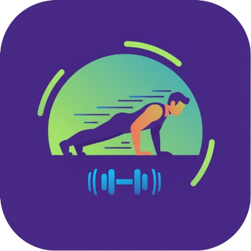

<p align="center">
  
</p>

<h1 align="center">Push2Unlock</h1>

<p align="center">
  <strong>🏋️ Exercise to earn your screen time — powered by AI pose detection</strong>
</p>

<p align="center">
  
  
  
  
  
</p>

<p align="center">
  Push2Unlock blocks addictive apps on your phone until you complete real physical exercises — verified in real-time using your camera and Google ML Kit's on-device pose detection. No cloud. No cheating.
</p>

---

## ✨ Features

| Feature | Description |
|---|---|
| **🔒 App Locking** | Automatically blocks monitored apps (Instagram, X, YouTube, etc.) when screen time runs out |
| **🤖 AI Pose Detection** | Uses Google ML Kit to verify exercises in real-time through your camera — no faking it |
| **🏋️ Multiple Exercises** | Supports **Head Nods**, **Squats**, and **Pushups** with adjustable rep counts |
| **⏱️ Reward Timer** | Earn 5–30 minutes of scroll time per completed workout |
| **📱 Foreground Detection** | Detects when you open a monitored app and instantly intervenes |
| **⚙️ Fully Configurable** | Choose which apps to monitor, exercise type, rep count, and reward duration |
| **🚀 Overlay Protection** | Forces Push2Unlock to the foreground when a blocked app is detected — no way around it |
| **🎯 Onboarding Flow** | Smooth first-run experience with permission setup |

## 🧠 How It Works

```
┌──────────────────────────────────────────────────────┐
│  User opens Instagram / X / YouTube / ...            │
│                        ▼                             │
│  Foreground App Detector (Usage Stats API)           │
│                        ▼                             │
│  ┌─────────────────────────────────────────────┐     │
│  │  Has remaining scroll time?                 │     │
│  │  ├── YES → Allow app usage, countdown timer │     │
│  │  └── NO  → Block app, show lock screen      │     │
│  └─────────────────────────────────────────────┘     │
│                        ▼                             │
│  User taps "Earn Scroll Time"                        │
│                        ▼                             │
│  Camera + ML Kit Pose Detection                      │
│  (Verifies real exercises in real-time)               │
│                        ▼                             │
│  Exercise complete → Unlock apps for N minutes       │
└──────────────────────────────────────────────────────┘
```

## 📸 Screenshots

> _Coming soon — contributions welcome!_

## 🚀 Getting Started

### Prerequisites

- [Flutter SDK](https://docs.flutter.dev/get-started/install) `>= 3.9.2`
- Android SDK with **API 34+** (compileSdk 36)
- A physical Android device (camera + pose detection require real hardware)
- Android Studio or VS Code with the Flutter extension

### Installation

```bash
# Clone the repository
git clone https://github.com/your-username/push2unlock.git
cd push2unlock

# Install dependencies
flutter pub get

# Run on a connected Android device
flutter run
```

### Build APK

```bash
# Debug build
flutter build apk --debug

# Release build
flutter build apk --release
```

## 📱 Permissions

Push2Unlock requires the following Android permissions to function:

| Permission | Purpose |
|---|---|
| `CAMERA` | Capture video feed for real-time pose detection during exercises |
| `PACKAGE_USAGE_STATS` | Monitor which app is currently in the foreground |
| `SYSTEM_ALERT_WINDOW` | Display overlay to block monitored apps and bring Push2Unlock to the front |
| `QUERY_ALL_PACKAGES` | Identify installed apps for the monitoring list |

> All permissions are requested at runtime with clear explanations during the onboarding flow.

## 🏗️ Project Structure

```
push2unlock/
├── lib/
│   ├── main.dart                          # App entry point & theme
│   ├── exercises/
│   │   ├── head_nods_detector.dart         # ML pose logic for head nods
│   │   ├── squats_detector.dart            # ML pose logic for squats
│   │   └── pushups_detector.dart           # ML pose logic for pushups
│   ├── pages/
│   │   ├── onboarding_page.dart            # First-run onboarding flow
│   │   ├── dashboard_page.dart             # Main dashboard with timer & app list
│   │   ├── exercise_page.dart              # Camera + pose detection UI
│   │   ├── settings_page.dart              # App config & exercise settings
│   │   └── blocked_app_page.dart           # Lock screen shown when app is blocked
│   ├── services/
│   │   ├── app_lock_service.dart           # Foreground interception & app blocking
│   │   └── foreground_app_detector.dart    # Usage Stats monitoring service
│   └── widgets/
│       └── pose_painter.dart               # Custom painter for skeleton overlay
├── assets/
│   └── icon/
│       └── icon.png                        # App launcher icon
├── android/                                # Android platform configuration
├── pubspec.yaml                            # Flutter dependencies & config
└── README.md
```

## 📦 Dependencies

| Package | Version | Purpose |
|---|---|---|
| [`google_mlkit_pose_detection`](https://pub.dev/packages/google_mlkit_pose_detection) | ^0.14.0 | On-device ML pose detection |
| [`camera`](https://pub.dev/packages/camera) | ^0.11.0+2 | Camera feed for exercise tracking |
| [`usage_stats`](https://pub.dev/packages/usage_stats) | ^1.3.0 | Foreground app detection |
| [`permission_handler`](https://pub.dev/packages/permission_handler) | ^11.3.1 | Runtime permission management |
| [`shared_preferences`](https://pub.dev/packages/shared_preferences) | ^2.2.2 | Persistent settings storage |
| [`introduction_screen`](https://pub.dev/packages/introduction_screen) | ^3.1.14 | Onboarding flow |

## ⚙️ Configuration

All settings are accessible from the in-app **Settings** page:

- **Monitored Apps** — Select from 15+ popular apps (Instagram, X, YouTube, TikTok, Snapchat, Reddit, WhatsApp, Telegram, Discord, LinkedIn, Netflix, etc.) or add custom app names
- **Reward Time** — 5, 10, 15, 20, 25, or 30 minutes per exercise session
- **Exercise Type** — Head Nods, Squats, or Pushups
- **Rep Count** — 5, 10, 15, or 20 reps per session
- **Test Mode** — Try exercises directly from settings before enabling the lock

## 🤝 Contributing

Contributions are welcome! Here's how you can help:

1. **Fork** the repository
2. **Create** a feature branch (`git checkout -b feature/amazing-feature`)
3. **Commit** your changes (`git commit -m 'Add amazing feature'`)
4. **Push** to the branch (`git push origin feature/amazing-feature`)
5. **Open** a Pull Request

### Ideas for Contribution

- 🍎 iOS support
- 📊 Exercise history & statistics dashboard
- 🏅 Gamification (streaks, achievements, leaderboards)
- 🧘 Additional exercise types (jumping jacks, lunges, planks)
- 🌙 Dark mode theme
- 🌍 Localization / i18n support
- 🔔 Push notification reminders

## 📝 License

This project is open source and available under the [MIT License](LICENSE).

## 🙏 Acknowledgements

- [Google ML Kit](https://developers.google.com/ml-kit) — On-device machine learning for pose detection
- [Flutter](https://flutter.dev) — Cross-platform UI framework
- [Material Design 3](https://m3.material.io) — Design system

---

<p align="center">
  <strong>Stop scrolling. Start moving. 💪</strong>
</p>
